# Object Detection (YOLO) - [People, Cats & Dogs] 

This Python project contains a custom implementation of the YOLO object detection algorithm (Tensorflow & Keras), which can be easily trained on the provided datasets. In this case, I have trained the model to do object detection on images of people, cats and dogs, as it is relatively easy to find good quality open-source datasets for these objects.

## Model Performance

### Images

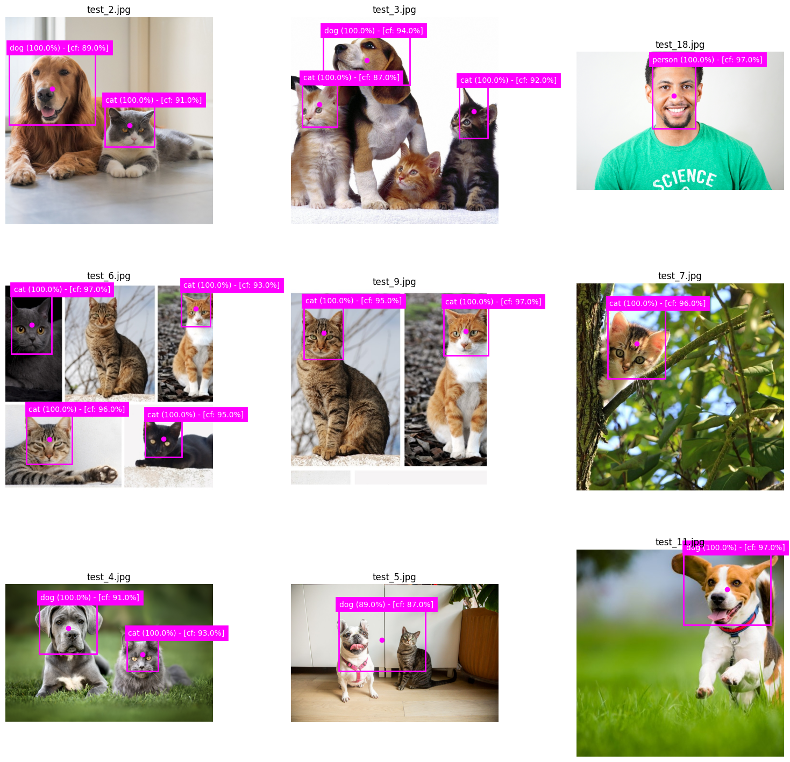

### Videos

	
	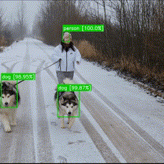
	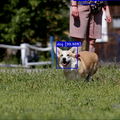 
	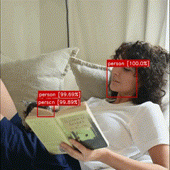
	 
	
	 
	

## The /datasets/ Folder
This project has a /datasets/ folder which contains the datasets that can be used for training the object detection models. Each /datasets/ subdirectory holds a dataset and each dataset folder, in turn, has an /images/ and an /annotations/ folder. The images are naturally stored in the /images/ subdirectory and the annotations are stored in the /annotations/ subdirectory. The annotations have to be in PASCAL VOC XML format.
You can easily add, remove, or replace datasets to adjust the scope of the object detection. 

NOTE that the /datasets/ folder currently only holds an example dataset to clarify the way datasets have to be structured.

## Using Trained Model Weights
In order to upload the trained model weights (.h5 file), I had to split the weights file using WinRar (creating multiple part.rar files).
Re-combining the files (after downloading) using WinRar is fairly straightforward. This video does a good job explaining how: https://www.youtube.com/watch?v=hIshRXe2pYU. 

---------------------------------

# Remarks on Model Performance

#### Aspect Ratio, Object Distortion & Object Size
This YOLO object detection model does not do a particularly good job of detecting and sizing bounding boxes for smaller objects. Additionally, the more the input image deviates in aspect ratio from the input dimensions of the model, the less accurate the model becomes. When cropping the input images to the same 1:1 aspect ratio as the input dimensions, the model performs much better (as can be seen directly below).

	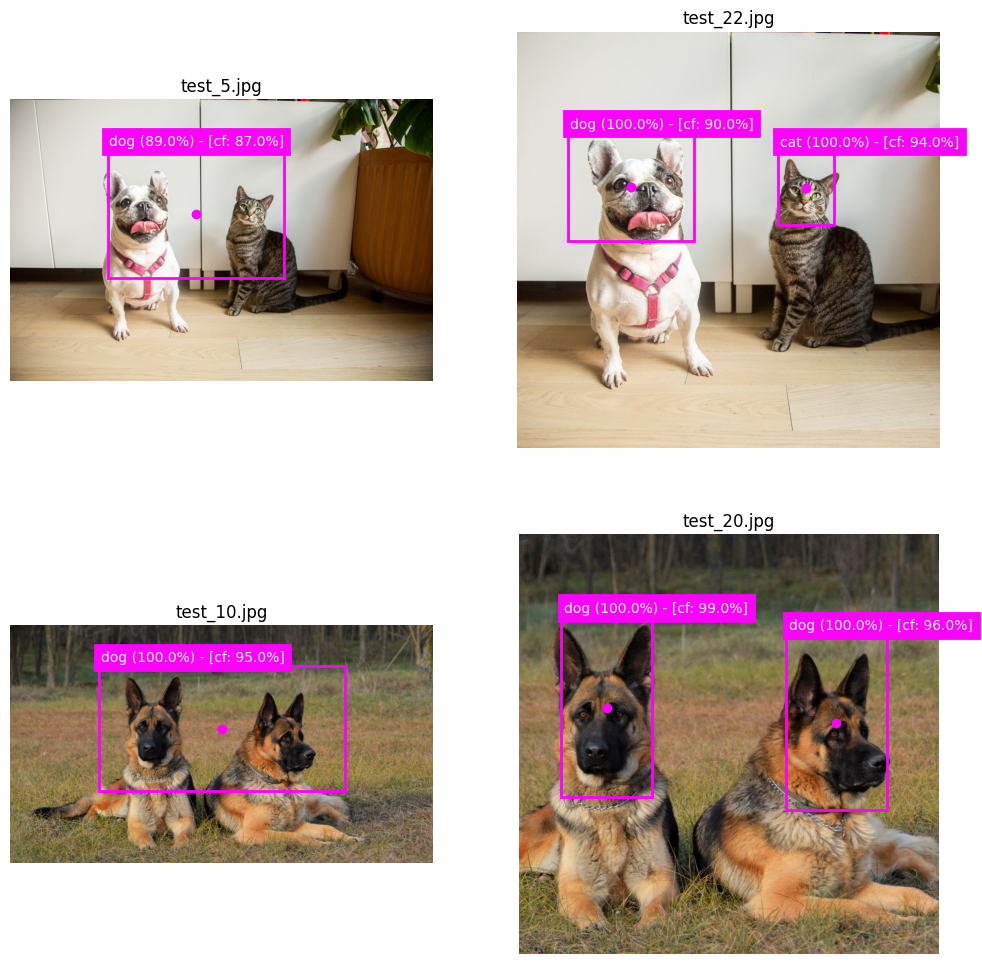

#### Less Accurate than Faster R-CNN
This YOLO object detector is less accurate in finding and especially in fitting the bounding boxes than the Faster R-CNN model (see my other repositories). It seems to me that the Region Proposal Network (RPN) that is part of the Faster R-CNN algorithm gives that model a more flexible, yet more accurate, target to fit. Since, when using RPN, offset variables are calculated for neighboring high IoU anchors, the model includes neighboring boxes that happen to overlap with the underlying ground truth object and also adjusts the coordinates for those boxes. The YOLO object detector, however, assigns the object to 1 anchor, in 1 grid. The remaining anchor-grid combinations are all set to 0. The result is that the YOLO model is trying to learn that there is only 1 grid-anchor pairing that is the answer, even though there might be many more predictions in the same or neighboring grids that have high overlap. You would want the model to include those predicted boxes as well and also for the model to fine-tune the coordinates of those boxes. The best way to describe it is that the Faster R-CNN tries to aim for the bulls-eye on a dart board, but is able to discern that hitting closer to the bulls-eye is better than hitting farther away. Whereas, YOLO seems to aim for the bulls-eye and cannot discern "fitness" outside of it.   

#### Data Quality
The majority of images in the datasets that this model is trained on have a relatively high resolution, sharp contrast, and objects that are generally displayed in clearly identifiable positions and poses. The quality of the results on new and "unseen" images/videos depends significantly on the degree of similarity between the properties of these images/videos and the ones within the dataset. Here, I have judged the model's performance based off of high-quality, high resolution, open-source stock images and videos. You will find the performance of the model to be noticeably less (but not poor) when you would, for example, provide it an image or video that is shot with a smartphone camera and suffers from things like blurring and over-exposure.

#### Further Improvements
Besides training the model on annotated data that the model will actually be used for (i.e. smartphone camera, security or dashboard camera footage), most of the model performance improvements would have to come from model architecture adjustments. YOLO v3 and subsequent versions work with larger and deeper models, which also employ residual connections, upsampling, increased input resolutions, and predictions at different scales. These adjustments, although computationally expensive, have shown to improve model performance, especially when detecting smaller objects.

---------------------

# YOLO Object Detection

### Prediction & Target Encoding

The YOLO object detection algorithm "*divides the input image into an S x S grid. If the center of an object falls into a grid cell, that grid cell is responsible for detecting that object.* 

	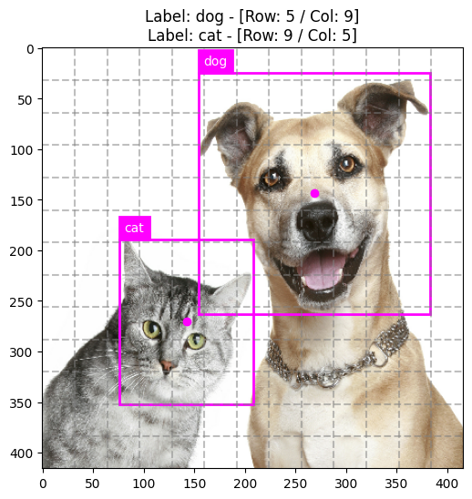

Starting from version 2, YOLO employs anchor boxes, which means that each grid cell consists of 4 coordinate variables, a confidence score, and class probabilities.
The coordinate variables (tx, ty, tw, th) are offset values that determine the location and dimensions of the bounding box relative to the grid cell and the underlying anchor.
The objectness *confidence scores (p0) reflect how confident the model is that the [anchor] box contains an object and also how accurate it thinks the box is that it predicts (Redmon J. et al.).*

	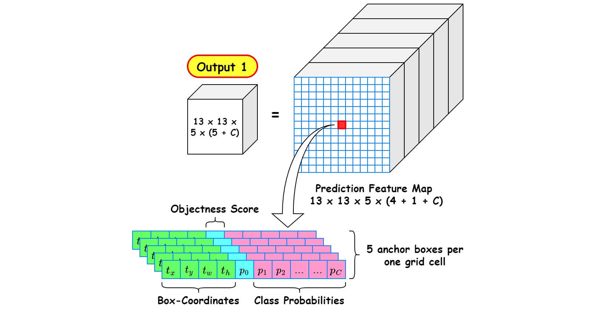
	
image source: Deep Learning Bible

Finally, each anchor get assigned a set of (C) class probabilities. These reflect the relative probabilities that the grid-anchor combination holds an object of a certain class. 

### Predicting Offset Variables

Instead of trying to predict the location and dimensions of the bounding boxes directly, we establish a set of "good priors", also called anchors, 
and let model predict offset variables for the mid-points and dimensions of the bounding boxes.
The offset variables tx and ty are used to predict the offset of the bounding box mid-point relative to top-left corner of the grid cell. 
The offset variables tw and th are used to predict the offset of the bounding box dimensions (width and height) relative to the dimensions of the corresponding anchor box.

    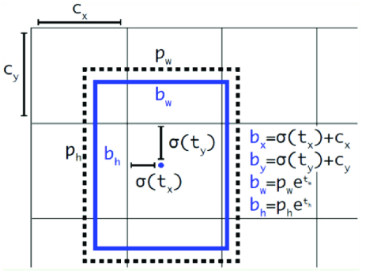
	
image source: https://medium.com/analytics-vidhya/object-detection-state-of-the-art-yolo-v3-79ad2937832

Having the model trying to predict relative offset variables from a anchor is a lot easier for the model than attempting to fit the locations and dimensions from random initialization.
Consequently, convergence is faster and the bounding boxes the model predicts more accurate.   

### Anchor Box Clustering

The K-means algorithm allows us to partition the bounding box dimensions within the dataset into groups with distance-minimizing centroids (optimally chosen width-height combinations for each group).
We make the choice for K, by incrementally adding to the number of anchors until we see a diminishing return in mean IoU between the bounding boxes and their assigned anchors. 

    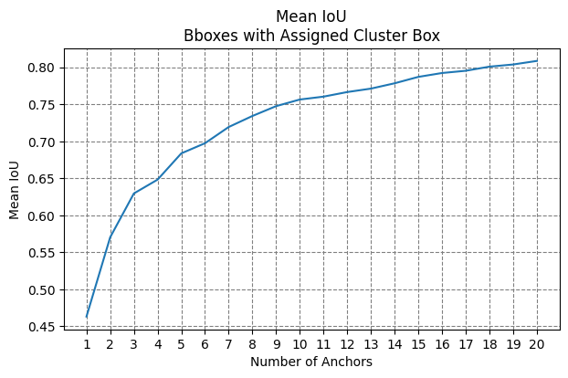

    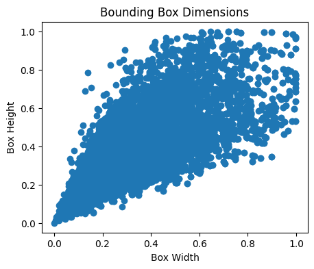
	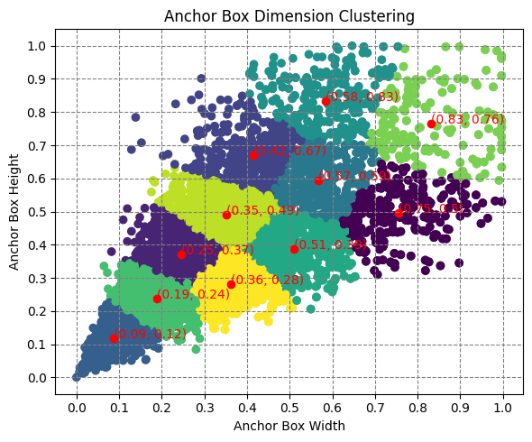

### Augmentation

To avoid overfitting the training data, we add data augmentation to the data pipeline. 
It includes random translations and adjustments to things like brightness and contrast.

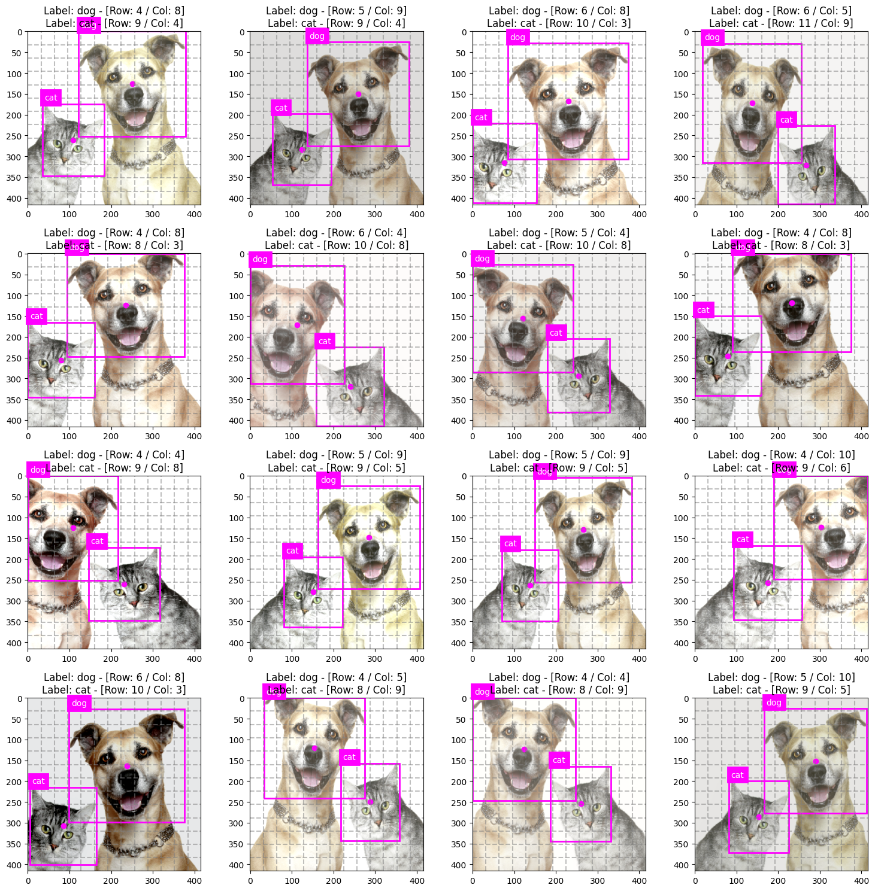

### YOLO Loss Function

Even though I have deviated somewhat from it, the loss function depicted below gives a pretty good idea of the relationship the model is trying to approximate.

"*Note that the loss function only penalizes classification error if an object is present in that grid cell ... It also only penalizes bounding box coordinate error if that predictor is “responsible” for the ground truth box (i.e. has the highest IOU of any predictor in that grid cell).*" (Redmon J. et al.)

    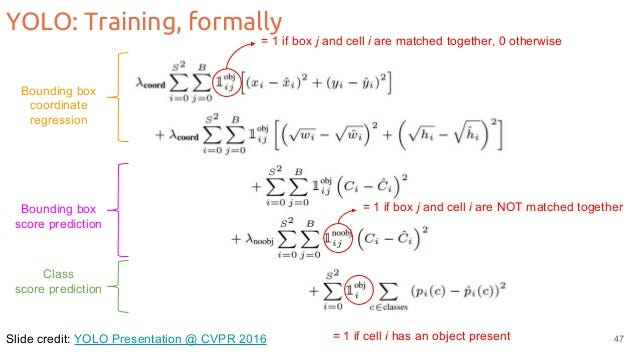
	
image source: https://stackoverflow.com/questions/57295132/for-the-yolo-loss-function-what-is-the-calculation-performed-in-order-to-obtain

The model uses "*sum-squared error because it is easy to optimize, however it does not perfectly align with our goal of maximizing average precision. It weights localization error equally with classification error which may not be ideal. Also, in every image many grid cells do not contain any object. This pushes the “confidence” scores of those cells towards zero, often overpowering the gradient from cells that do contain objects. This can lead to model instability, causing training to diverge early on. To remedy this, we increase the loss from bounding box coordinate predictions and decrease the loss from confidence predictions for boxes that don’t contain objects. We use two parameters, coord and noobj to accomplish this. We set [lambda]coord = 5 and [lambda]noobj = 0.5.* (Redmon J. et al.)

*Sum-squared error also equally weights errors in large boxes and small boxes. Our error metric should reflect that small deviations in large boxes matter less than in small boxes. To partially address this we predict the square root of the bounding box width and height instead of the width and height directly.*" (Redmon J. et al.)

### Non-Max Suppression (Post-Processing)

We refine the bounding boxes outputted by the model by applying non-max suppression (NMS). This technique helps us to select the best bounding box when we are dealing with overlapping boxes.

With NMS, we discard bounding boxes with confidence scores lower then a given threshold. The remaining boxes are pruned iteratively by discarding the lower confidence box when deciding between two overlapping bounding boxes (boxes with an IoU over a certain threshold). 

    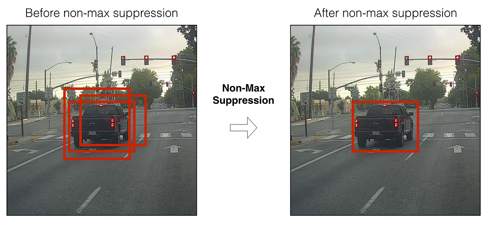
	
image source: https://towardsdatascience.com/non-maximum-suppression-nms-93ce178e177c

### Evaluating Model

Besides inspecting model performance visually (which is essential as well), we would like to use metrics in order to objectively evaluate and compare performance.

#### Precision-Recall Curve
"*...the higher the precision, the more confident the model is when it classifies a sample as Positive. The higher the recall, the more positive samples the model correctly classified as Positive.*

*When a model has high recall but low precision, then the model classifies most of the positive samples correctly but it has many false positives (i.e. classifies many Negative samples as Positive). When a model has high precision but low recall, then the model is accurate when it classifies a sample as Positive but it may classify only some of the positive samples.*" (blog.paperspace.com)

#### mean Average Precision (mAP)
"*The average precision (AP) is a way to summarize the precision-recall curve into a single value representing the average of all precisions... Usually, the object detection models are evaluated with different IoU thresholds where each threshold may give different predictions from the other thresholds...To calculate the mAP, start by calculating the AP for each class. The mean of the APs for all classes is the mAP.*" (blog.paperspace.com)

    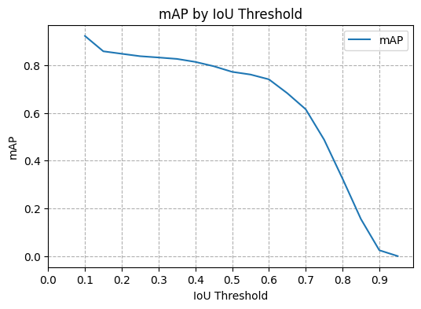

----------------------

# [EXTRA] Data Input Pipeline (tf.Graph)
"*[Eager Execution] means TensorFlow operations are executed by Python, operation by operation, and return results back to Python. While eager execution has several unique advantages, graph execution enables portability outside Python and tends to offer better performance. Graph execution means that tensor computations are executed as a TensorFlow graph, sometimes referred to as a tf.Graph.*" (tensorflow.org)

"*Graphs can speed up your code, but the process of creating them has some overhead. For some functions, the creation of the graph takes more time than the execution of the graph. This investment is usually quickly paid back with the performance boost of subsequent executions, but it's important to be aware that the first few steps of any large model training can be slower due to tracing.*" (tensorflow.org)

    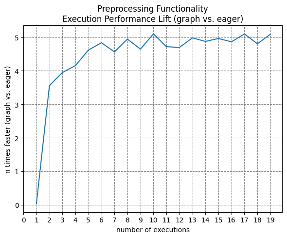

It makes sense that we do not only need to look at converting the actual model into a Tensorflow graph but also the operations that deliver the data to the model. If we do not, we are limited by the speed at which we preprocess and deliver the input data (bottleneck).

For the purposes of this project, I evaluated the 4 following data pipeline configurations: 

    

The results:

    

#### Pipeline 1 vs. Pipeline 2
Pipeline 1 extends the keras.utils.Sequence class to eagerly perform preprocessing on each image and each annotation file every time they are fed into the network. Some, but clearly not a lot, of the overhead might be saved in memory (30% utilization). This pipeline has low CPU utilization (24%) and relatively low GPU utilization (60%), which suggests that the bottleneck is not the hardware, but the code itself (eager execution).
Pipeline 2, in contrast, uses the tensorflow framework to trace a graph and employ hardware acceleration. Using pipeline 1 as a reference, pipeline 2 is able to utilize more of the CPU's capacity (45%). This means that the data is fed into the network much faster and the GPU can be employed at a very high utilization rate (94%), to the point that this now becomes the new bottleneck at times. Because pipeline 2 is so much more efficient, we see time per epoch and time per step decrease significantly.

#### Pipeline 2 vs. Pipeline 3
Pipeline 1 & 2 give us a beautiful way of showing the efficiency gains that graph execution can bring over eager execution as both pipelines are identical in functionality and only different in the code framework used.
Pipeline 3 takes the preprocessing functionality of pipeline 2 and simply adds the image/annotation augmentation to it. The augmentation functionality is relatively demanding from a computational standpoint. The CPU utilization is now consistenly at 100%. This means that the data pipeline, which is executed using CPU resources, has become the new bottleneck. GPU utilization (80%) has come down as the data is not fed into the network as fast as before (with pipeline 2). This can also be seen from the uptick in the time per epoch and time per step.

#### Pipeline 3 vs. Pipeline 4
Pipeline 3 has the CPU as its bottleneck. We, thus, have to look elsewhere for underutilized resources to which we can offload some of the CPU workload in pipeline 4. Pipeline 1 through 3 all have relatively low memory usage (around 30%), which means we may want to look to store the resulting dataset from expensive one-time operations (like opening and reading image data) in memory. I have pain-stakingly (considering variable number of bounding boxes) broken up the preprocessing functionality into 3 seperate functions for reading, augmenting, and encoding data. In pipeline 4, the result of the reading data function is cached into memory at the first epoch of training, meaning we have successfully offloaded the opening and reading of image and (.txt) annotation files from the CPU into memory. Compared to pipeline 3, memory utilization has significantly increased (to around 83%), the CPU bottleneck is relieved (utilization at 58%), and GPU utilization has increased again (to 90%). Even though there might still be ways of fine-tuning performance, pipeline 4 is a relatively well-balanced pipeline, which utilizes a lot of the hardware capacities. The result is a pipeline that can do preprocessing with augmentation at comparable speeds as pipeline 2 does preprocessing without augmentation. 

--------------------------------

### References
- Redmon J. et al. (2016) *You Only Look Once: Unified, Real-Time Object Detection.* University of Washington.